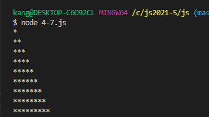
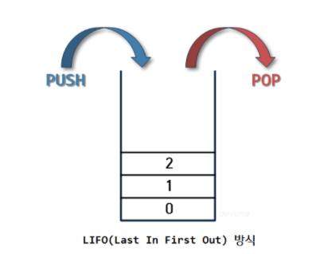
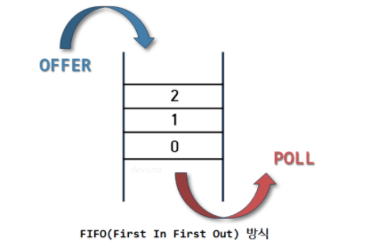

# [강현준201840203]
## [5월25일]
### 1.express 모듈
+ 모듈설치
```javascript
$ npm install express@4
```
+ 클라이언트 - 요청 대상
+ 서버 - 응답 대상
+ 요청 메시지 - 클라이언트가 서버로 보내는 메시지
+ 응답 메시지 - 서버가 클라이언트로 보내는 메시지
### 2. express 모듈을 사용한 서버 생성과 실행
+ express 모듈의 기본 메소드
+ express() - 서버 애플리케이션 객체 생성
+ app.use() - 요청이 왔을 때 실행할 함수를 지정
+ app.listen() - 서버 실행
```javascript
//모듈 추출
const express = new require('express');
//서버 생성
const app = expresss();
//request 이벤트 리스너 설정
app.use((request,response)=>{
    response.send('<h1>Hello express</h1>');
});
//서버 설정
app.listen(55273,()=>){
    console.log('Server running at http://127.0.0.1:52273')
});
```
### 3.페이지 라우팅
+ 클라이언트 요청에 적절한 페이지를 제공하는 기술
+ express 모듈의 페이지 라우팅 메소드
+ get(path,callback) - GET 요청이 발생했을때 이벤트 리스너 지정
+ post(path,callback) - POST 요청이 발생했을때 이벤트 리스너 지정 
+ put(path,callback) - PUT 요청이 발생했을때 이벤트 리스너 지정
+ delete(path,callback) - DELETE 요청이 발생했을때 이벤트 리스너 지정
+ all(path,callback) - 모든 요청이 발생했을때 이벤트 리스너 지정


# [강현준201840203]
## [5월18일]
### 1.전역변수
+ 아무런 제약 없이 사용할 수 있는것이 변수라면 전역변수
+ process 객체는 프로세스 정보를 제공하며, 제어 할 수 있는 객체
### 2.process 객체 속성
+ env - 컴퓨터 환경 정보를 나타냄
+ version - Node.js버전을 나타냄
+ versions - Node.js와 종속된 프로그램 버전을 나타냄
+ arch - 프로세서의 아키텍처를 나타냄
+ platform - 플랫폼을 나타냄
### 3.process 객체 메소드
+ exit([exitCode=0]) - 프로그램 종료
+ memoryUsage() - 메모리 사용정보 객체를 리턴
+ uptime() - 현재 프로그램이 실행된 시간을 리턴 
### 4.os모듈 
+ 모듈 사용 추출

```javascript
const os = require('os');
```

##### os모듈 메소드
+ hostname() - 운영체제의 호스트이름을 리턴
+ type() - 운영체제의 이름을 리턴   
+ platform() - 운영체체의 플랫폼을 리턴
+ arch() - 운영체제의 아키텍처를 리턴
+ release() - 운영체제의 버전을 리턴
+ uptime() - 운영체제의 실행된 시간을 리턴
+ loadavg() - 로드에버리지 정보를 담은 배열을 리턴
+ totalmem() - 시스템의 총 메모리를 리턴
+ freemem() - 시스템의 사용 가능한 메모리를 리턴
+ cpus() - cpu의 정보를 담은 객체를 리턴
+ getNetworkInterfaces() - 네트워크 인터페이스의 정보를 담은 배열을 리턴
### 5. url 모듈
+ 모듈 추출

```javascript
const url = require('url');
```

##### url모듈 메소드
+ parse(urlStr[,parseQueryString=false,slashesDenoteHost=false]) - URL 문자열을 URL 객체로 변환해 리턴
+ format(urlObj) - URL 객체를 URL 문자열로 변환해 리턴
+ resolve(from,to) - 매개변수를 조합하여 완전한 URL 문자열을 생성해 리턴

### 6.File System 모듈
##### 추출 방법
```javascript
const fs = require('fs');
```
##### 파일 읽기
+ fs.readFileSync(<파일 이름>) - 동기적으로 파일을 읽음
+ fs.readFile(<파일 이름>,<콜백 함수>) - 비동기적으로 파일을 읽음
##### 비동기 처리 장점
+ 웹 서버를 C++로 만드렴ㄴ 빠르지만, 개발과 유지보수가 어려움.
+ 프로그래밍 언어자체는 느리지만 개발 속도와 유지 보수성이 좋음.
+ 손쉽게 비동기 처리를 구현하여 빠른 처리가 가능.
##### 파일쓰기
+ fs.writeFileSync(<파일 이름>,<문자열>) - 동기적으로 파일을 씀
+ fs.writeFile(<파일 이름>,<문자열>,<콜백 함수>) - 비동기적으로 파일을 씀
##### 노드패키지
+ 패키지 매니저 모듈 관리 프로그램을 사용해 모듈 쉽게 설치 가능
+ Node.js는 npm(Node.js Package Manager)패키지 매니저를 사용
+ 외부 모듈 설치
##### request 모듈
+ 웹 요청을 쉽게 만들어주는 모듈 
+ 설치 명령어 -> npm install request

```javascript
//모듈 추출
const request = requir(`request`);
//request 모듈 사용
const url = `http://www.hanbit.co.kr/store/books/new_book_list.html`;
request(url,(error,response,body) => {
    console.log(body)
});
```
##### cheeio 모듈
+ request 모듈로 가져온 웹 페이지는 단순한 HTML 문자열
+ cheerio 모듈 - 가져온 웹 페이지의 특정 위치에서 손쉽게 데이터를 추출
+ 설치 명령어 - npm install cheerio


# [강현준201840203]
## [5월11일]
### 1.Date객체
+ new Date() - 현재시간으로  Date 객체를 생성
+ new Date(<유닉스 타임>) - 유닉스타임(1970년 1월 1일 00시 00분 00초로부터 경과한 밀리초)으로 객체 생성
+ new Date(<시간 문자열>) - 문자열로 Date객체 생성
+ new Date(<년>,<월-1>,<일>,<시간>,<분>,<초>,<밀리초>) - 시간요소를 기반으로 Date객체를 생성
+ Date 객체 생성
```javascript
let dateA = new Date();
console.log(dateA);

let dateB = new Date(6313454231);
console.log(dateB);

let dateC = new Date("December 9 , 19991 21:30:00");
console.log(dateC);

let dateD = new Date(1991,12-1,9,21,30,0,0);
console.log(dateD);
```
### 2.Array 객체 
+ concat() - 매개 변수로 입력한 배열의 요소를 모두 합쳐 배열을 만들어 리턴
+ join() - 배열안의 모든 요소를 문자열로 만들어 리턴
+ pop()* - 배열의 마지막 요소를 제거하고 리턴
+ push()* - 배열의 마지막 부분에 새로운 요소를 추가
+ reverse()* - 배열의 요소 순서를 뒤집음
+ slice() - 배열 요소의 지정한 부분을 리턴
+ sort()* - 베열 요소를 정렬
+ splice()* - 배열 요소의 지정한 부분을 삭제하고 삭제한 요소를 리턴
### 3. ECMAScript5에서 추가된 메소드
+ forEach() - 배열의 요소를 하나씩 뽑아 반복을 돌림
+ map() - 콜백 함수에서 리턴하는 것을 기반으로 새로운 배열을 만듬
+ filter() - 콜백 함수에서 true를 리턴하는 것으로만 새로운 배열을 만들어 리턴
```javascript
[52,273,32].forEach((item, index) =>{

}); // ECMAScript5에 추가된 Array 객체의 메소드 콜백 함수 형태
```
+ 프로토타입에 메소드 추가
```javascript
String.prototype.contain=function(input){
    return this.index0f(input) >= -1;
}

console.log('안녕하세요'.contain('안녕'));
console.log('안녕하세요'.contain('빙그르르'));
```
### 4. JSON 객체
+ 문자열은 큰따옴표로 만들어야함
+ 모든 키는 큰따옴표로 감싸야함
+ 숫자, 문자열, 불 자료형만 사용 할 수 있음
+ JSON.stringify(<객체>,<변환함수>,<공백갯수>) - 자바스크립트 객체를 문자로 만듬
+ JSON.parse(<문자열>) - 문자열을 자바스크립트 객체로 파싱

### 5.예외처리
+ TypeError를 기본 예외 처리로 처리
```javascript
//함수 선언
function callTenTimes(callback){
    if(callback){
        for(let i = 0; i<10; i++){
            callback();
        }
    }else{
        console.log(`매개 변수 callback이 지정되지 않았습니다.`);
    }
}
//정상 실행
callTenTimes(function () {console.log(`안녕하세요`);});
//예외 발생
callTenTimes();
```
+ try catch finally
```javascript
try{
    //예외가 발생하면
} catch (exception){
    //여기서 처리합니다.
} finally {
    //여기는 무조건 실행됩니다.
} // catch finally 구문 필요 없으면 생략 가능
```
+ 에외 강제 발생
```javascript
//예외 객체 만듦
const error = new Error('메시지');
error.name = '내 마음대로 오류';
error.message = '오류 메시지';
//예외 발생
throw error;
```

# [강현준 201840203]
## [5월4일]
### 1.프로토타입
+ **프로토 타입**- 모든 함수가 가지고 있는 속성으로 해당 함수를 생성자 함수로 사용했을 때
+ 프로토 타입 메소드 생성

```javascript
//생성자 함수
function Product(name,price){
    this.name=name;
    this.price=price;
}
//프로토타임 메소드 선언
Product.prototype.print=function(){
    console.log('$[product.name]의 가격은 $[product.price]원 입니다');
};
//객체 생성
let product = new Product("바나나",1200);
//출력
console.log(product);
```

### 2. 값을 확인하는 코드

```javascript
let zeroNumber = 0;
let falseBoolean = '';
let emptyString = '';
let undefinedValue;
let nullValue= null;

if(zeroNumber == null)
    console.log('은 존재하지 않는 값입니다.');

if(falseBoolean == null)
    console.log('false는 존재하지 않는 값입니다.');

if(emptyString == null)
    console.log('빈 문자열은 존재하지 않는 값입니다.');

if(undefinedValue == null)
    console.log('undefined는 존재하지 않는 값입니다.');

if(nullValue == null)
    console.log('null은 존재하지 않는 값입니다.');
//결과  undefined는 존재하지 않는값입니다.
//      null은 존재하지 않는 값입니다.
```
### 3.기본 자료형과 객체 자료형의 차이
+ 공통점 : 속성과 메소드 사용가능
+ 차이점 : 기본자료형은 객체가 아니므로 속성과 메소드를 추가 할 수 없음
+ 기본 자료형에 속성 메소드 추가 방법 

```javascript
//변수선언
let primitiveNumber = 273;
//프로토 타입에 메소드 추가
Number.prototype.method = function(){
    return 'Primitive Method'
};
//메소드 실행
console.log(primitiveNumber.method());
//결과
Primitive Method
```
### 4.Number객체 
+ 객체 생성 

```javascript
let numberFromLiteral = 273;
let numberFromConstructor = new Number(273);
```
+ Number 객체의 메소드
+ toExponential() => 숫자를 지수 표시로 나타낸 문자열을 리턴
+ toFixed() => 숫자를 고정소수점 표시로 나타낸 문자열을 리턴
+ toPrecision() => 숫자를 길이에 따라 지수 표시 또는 고정소수점 표시로 나타낸 문자열을 리턴


# [강현준 201840203]
## [4월27일]
### 1.객체
+ 객체기본 - 객체는 여러 개의 자료형을 한번에 저장하는 자료형
+ 객체와 배열의 차이점 - 요소에 접근 할 때 **배열은 인덱스** 사용 , **객체는 키** 사용
+ 객체 선언

```javascript
//객체 선언 
let product = {
    제품명 : '냉장고',
    회사 : '삼성',
    가격 : '1,600,000'
};
//출력
console.log(product);

```
=> 키 = 제품명 , 회사 , 가격    
=> 속성 = 냉장고 , 삼성 ,1,6000,000
+ 객체 속성 접근 방법 
```javascript
product['제품명'] =>'냉장고'
product['회사'] => '삼성'
product.제품명 =>'냉장고'
product.회사 =>'삼성'
```
### 2.객체와 반복문 
+ for in 반복문을 이용해 객체 반복 적용

```javascript
//객체 생성
let object = {
    name: '사과'
    price: 1000
};
//출력
for(let key in object){
    console.log('$[key]:$[object[key]]');
}    
출력결과 => name:사과 price:1000
```

### 3. 속성과 메소드 
+ 요소 - 배열 내부에 있는 값 
+ 속성 - 객체 내부에 있는 값
+ 메소드 - 객체의 속성 중 자료형이 함수인 속성

```javascript
let object = {
    name:'망고'
    price:1200
    print: function(){
        console.log('$[this.name]의 가격은 $[this.price]원 입니다')
    }
};
//메소드 호출
object.print();
```

+ this 키워드 - 자신이 가지고 있는 속성임을 표시 
### 4. 생성자 함수와 프로토 타입
+ **생성자 함수** - 객체를 만드는 함수  , 대문자로 시작하는 이름을 사용

```javascript
//생성자 함수
function Product(name,price){
    this.name=name;
    this.price=price;
}
//객체 생성
let product = new Product("바나나",1200);
//출력
console.log(product);
``` 


# [강현준 201840203]
## [4월 13일]
### 1. 익명함수
+ 이름을 붙이지 않고 함수를 생성 
+ 한번 만 사용하는 경우가 많음<br>test
형태

```javascript
 let<함수이름>=function(){};
```
---
### 2. 선언적 함수 
+ 이름을 붙여 함수를 선언하면 선언적 함수<br>
형태
```javascript
 function<함수이름>(){ }
```
---
### 3. 화살표 함수 
+ 익명함수를 더 간단하게 생성 할 수 있는 방법<br>

형태
```javascript
()=>{ }//하나의 표현식을 리턴하는 함수를 만들 때 중괄호 생갹 가능
```
---
### 4. 함수의 기본형태
```javascript
function <함수이름>(<매개변수>){
    <함수코드>
    return <리턴값>
}
```
---
### 5. 함수 매개 변수 초기화
+ 매개변수를 입력하지 않아도 함수 호출가능
```javascript
//함수선언
function print(name,count){
    console.log('$(name)이$(count)개 있습니다.')
}
//함수 호출
print("비트코인",10);
print("비트코인");
```
---
### 6. 콜백함수 
+ 함수의 매개 변수로 전달되는 함수
+ 어떤 이벤트에 의해 호출되는 함수


# [강현준 201840203]
## [04월06일]
### 1. 중첩 반복문
형태 
```javascript
let output = ""; // 변수
   for (let i = 0; i < 10; i++) { //i는 0부터 9까지 i를 하나씩 증가시킨다.
      for(let j = 0; j< i+1;j++){ //j는 0부터 i까지 j를 하나씩 증가시킨다.
        output += "*"; //output에 있는 데이터에 *을 하나씩 추가
    }
    output +="\n"; //줄바꿈
}
console.log(output);
```
ㄴ
-실행결과 

### 2. break 키워드<br>
무한 반복을 빠져 나갈떄 쓰는 키워드
``` javascript
// 짝수를 찾으면 break키워드로 반복문을 벗어납니다.
let i =0;
let array = [1,31,273,57,8,11,32];
let output;

while (true) {
 if (array[i] % 2 == 0){
    output = array[i];
    break;
}
    i=i+1; 
}
console.log(`처음 발견한 짝수는 ${output}입니다.`);
```
### 3. continue 키워드
반복문 내부에서 현재 반복을 멈추고 다음 반복을 진행하게함
```javascript

for (let i = 1; i<10; i++){
    if (i % 2 == 0) {
        continue; //짝수라면 다음 반복으로 넘어감  -> 이 다음 코드는 실행x
    }
    console.log(i);
}

```
### 4. 함수

+ push+pop => stack 사용가능
+ push+shift => queue 사용가능
+ stack = 먼저 넣은것은 나중에 꺼내진다 LIFO(last in first out)
+ queue = 먼저 들어간것은 먼저 꺼내진다 FIFO(first in first out) 
---
+ stack 구조

+ queue구조


+ splice 함수
  -배열에서 특정 항목을 제거 할 때 사용
  -제거하는 과정에서 해당 원소가 몇번째인지 알려줘야함
  -기존 배열 자체를 변경

+ slice 함수
  -배열을 잘라낼 때 사용
  -기존의 배열은 달라지지 않음 
  -시작 인덱스와 종료 인덱스를 같은 값을 넣으면 빈 배열이 반환됨
  

 

# [강현준 201840203]
## [03월30일]
### 1. 배열
기본 형태
```javascript
        let array=[52,1,'안녕','잘가',true,false]
        undefined
        array
        [52,1,'안녕','잘가',true,false]
```
---

### 2.while 반복문
<p>기본 메커니즘</p>


<p>기본형태</p>

```jsx
    while(조건){
    실행내용(반복 내용)
}
```
---

### 3.For 반복문
<p>기본형태</p>

```jsx
for(초기화식; 조건식; 증감식){
    실행 문장;
}

//변수 선언
let output =0 ; 
//반복 수행
for(let i=0; i<=100; i++;){
    output *= i;
}
//출력
console.log(output);
실행 결과 -->5050출력
```

---

### 4.For in 반복문
 for in 반복문은  **객체(오브젝트)에서 사용하는 반복문**
<p>기본형태</p>

```jsx
    for(let 인덱스 in 배열){
        문장

    }
```

### 5.For of 반복문
 for of 반복문은 **배열에서 사용하는 반복문**
<p>기본형태</p>

```jsx
    for(let 요소 of 배열){
         객체의 프로퍼티의 개수만큼 반복적으로 실행하고자 하는 실행문

    }
```


#  강현준[201840203]
##  [03월23일]
오늘 배운 내용 요약 <br>
<ul>
<p><strong>변수 선언  (var, let, const)</strong></p>
<li>>var -->  같은 이름의 변수 선언이 돼 있더라도 다시 선언해서 데이터를 할당</li>
<li>let--> 변수의 중복 선언 x  변수의 할당된 데이터 변경 o </li>
<li>const--> 변수의 중복 선언 x  변수의 할당된 데이터 변경 x<br></li>
</ul><br>
<p><strong>typeof</strong> --> 값의 유형 , 자료형을 확인 할 때 사용</p><br>
<strong>NAN</strong>--> 숫자를 문자로 나누는등 말도안되는 수식을 작성할떄 사용 -->let IsNaN =10/"칠";

<br><p><strong>조건문 if</strong>-->조건에 부합 했을때 결과값 </p>
<p><strong>else</strong>-->조건에 부합하지 않았을 떄 결과값 </p>

```jsx
function testIf(data){
    if(data%3==0){
        console.log('나머지 0')
    }else if(data%3==1){
        console.log('나머지 1')
    }else{
        console.log('x')
    }
}
```

-->if (조건) {트루일 떄 결과} 
    else if (조건2){조건2가 트루일 때 결과}
    else {모두 false일 때 결과}

<p><strong>and 조건</strong>--> 모든 조건이 true 여야 true   &&사용  </p>
<p><strong>or 조건</strong>--> 조건 중 하나라도 충족하면 true  ||사용  </p>


# 강현준[201840203]
## [03월16일]
>오늘 배운 내용 요약<br />
>여러줄 요약<br />
>하하하하<br />

배운내용
자바 


